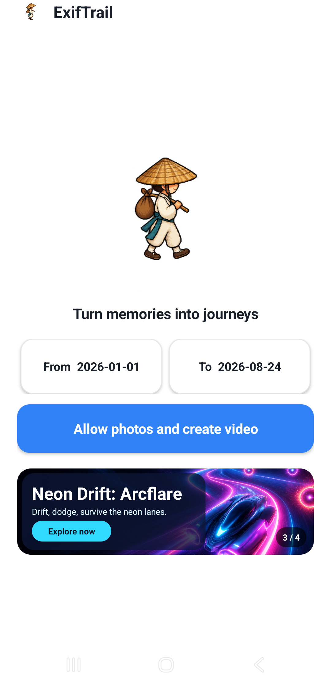
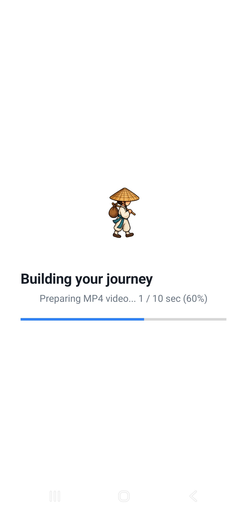
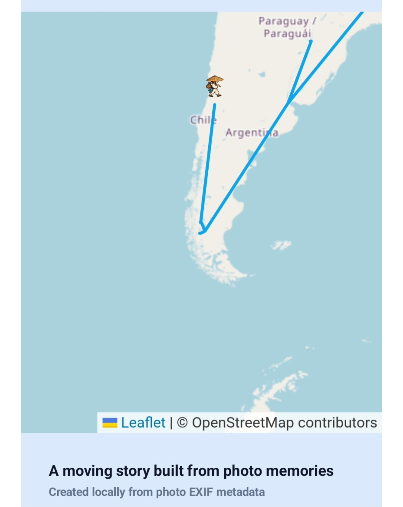

# ExifTrail

<p align="center">
  <a href="README.en.md"><strong>🇬🇧 English</strong></a>
  &nbsp; · &nbsp;
  <a href="README.ko.md"><strong>🇰🇷 한국어</strong></a>
</p>

<p align="center">
  <a href="https://amaranth92.github.io/exiftrail/">웹 데모</a>
  &nbsp; · &nbsp;
  <a href="https://github.com/amaranth92/exiftrail">GitHub</a>
  &nbsp; · &nbsp;
  <a href="https://github.com/amaranth92/exiftrail/raw/refs/heads/master/public/downloads/ExifTrail-Android.apk">Android APK 다운로드</a>
</p>


## ExifTrail은 어떤 앱인가요?

ExifTrail은 휴대폰에 이미 저장된 여행 사진을 시간순 이동 경로 영상으로
바꿔주는 개인정보 보호 중심의 오픈소스 프로젝트입니다. 사진의 촬영 시각과
GPS EXIF 정보를 로컬에서 읽고, OpenStreetMap 위에 경로를 그린 뒤, 김삿갓
캐릭터가 이동하는 세로형 영상을 만듭니다.

이 프로젝트는 앱스토어 배포를 목표로 하지 않습니다. 소스코드를 공개해 누구나
직접 실행하고, 구조를 확인하고, 개선할 수 있게 하는 것이 목적입니다.

## 만든 이유

Google Timeline처럼 여행 경로가 움직이는 영상을 만들어보고 싶었습니다. 하지만
Google에 지속적으로 위치 기록을 제공하는 것이 싫어서 Google Timeline을 꺼두었고,
그 결과 해당 기능을 사용할 수 없었습니다.

여행을 가면 사진을 찍습니다. 사진에는 이미 촬영한 시간과 촬영한 장소가 남아
있습니다. 그래서 별도의 지속적인 위치 기록 없이, 내가 가지고 있는 여행 사진의
EXIF 정보만으로 Google Timeline과 비슷한 결과를 만들도록 ExifTrail을 개발했습니다.

> Google Timeline을 켜지 않고, 내가 가진 사진만으로 만드는 여행 경로 영상.

## 주요 특징

| 기능 | 설명 |
| --- | --- |
| 로컬 우선 | 기본 흐름에서 사진과 EXIF 분석이 기기 안에서 처리됩니다. |
| 시간순 경로 | 촬영 시각으로 사진을 정렬하고 GPS 좌표를 연결합니다. |
| 세로형 영상 | 완성된 경로를 공유하기 좋은 세로 영상으로 저장합니다. |
| Android + 웹 | Android 사진첩을 직접 분석하거나 브라우저에서 사진을 선택할 수 있습니다. |
| 소스 공개 | 앱스토어 계정 없이 코드를 확인하고 직접 실행할 수 있습니다. |

## 결과 예시

샘플 영상:

<video controls width="320" poster="https://github.com/amaranth92/exiftrail/raw/refs/heads/master/public/docs/screenshots/exiftrail-4-final.jpg">
  <source src="https://github.com/amaranth92/exiftrail/raw/refs/heads/master/public/demo/exiftrail-sample-route.mp4" type="video/mp4">
</video>

[샘플 MP4 열기 또는 다운로드](https://github.com/amaranth92/exiftrail/raw/refs/heads/master/public/demo/exiftrail-sample-route.mp4)

## 화면 예시

<table>
  <tr>
    <td></td>
    <td></td>
  </tr>
  <tr>
    <td></td>
    <td></td>
  </tr>
</table>

## 동작 방식

1. 분석할 날짜 범위를 선택합니다.
2. Android에서는 사진 접근 권한을 허용하고, 웹에서는 분석할 사진을 선택합니다.
3. 각 사진의 촬영 시각과 GPS 좌표를 읽습니다.
4. 촬영 시각순으로 정렬하고 GPS 정보가 없는 사진은 경로에서 제외합니다.
5. 거의 같은 좌표를 줄이고 비정상적으로 큰 GPS 이동을 제외합니다.
6. 지도 위에 경로와 캐릭터를 애니메이션으로 표시하고 세로 영상을 저장합니다.

## Android 휴대폰에 설치하기

Google Play 스토어가 아니라 GitHub에서 APK를 직접 내려받아 설치하는
방식입니다.

### 1. APK 다운로드 및 설치

[ExifTrail-Android.apk 다운로드](https://github.com/amaranth92/exiftrail/raw/refs/heads/master/public/downloads/ExifTrail-Android.apk)

1. Android 휴대폰에서 위 링크를 열고 APK를 다운로드합니다.
2. 다운로드 알림이나 `Downloads` 폴더에서 APK 파일을 엽니다.
3. 설치가 차단되면 안내창의 **설정**을 눌러, 사용 중인 브라우저 또는
   파일 관리 앱에 **알 수 없는 앱 설치**를 허용합니다. 그 다음 APK를 다시 엽니다.
4. **설치**를 누른 뒤 **열기**를 누릅니다.

Google Play가 아닌 GitHub에서 직접 설치하는 파일이므로 Android 또는 Play
Protect에서 경고가 표시될 수 있습니다. 이 저장소를 신뢰하는 경우에만
설치하세요.

### 2. 첫 경로 영상 만들기

1. 첫 화면에서 `From`과 `To` 날짜를 정합니다.
2. **Allow photos and create video**를 누릅니다.
3. 사진 접근 권한을 묻는 화면에서 전체 사진첩을 분석하려면 **모든 사진
   허용**을 선택합니다. **선택한 사진**을 고르면 선택한 사진만 분석합니다.
4. 사진의 촬영 시각과 GPS 위치를 읽는 동안 기다립니다.
5. 경로 미리보기가 준비되면 **Download video**를 누릅니다.
6. 완성된 MP4는 휴대폰 갤러리의 `Movies/ExifTrail` 폴더에서 확인합니다.

권한 창이 다시 나오지 않으면 **설정 → 앱 → ExifTrail → 권한 → 사진 및 동영상**
에서 필요한 접근 권한을 허용하세요. GPS 좌표가 없는 사진은 경로 지점으로
사용할 수 없으므로, 위치 정보가 없는 사진만 선택하면 경로가 만들어지지 않을
수 있습니다.

## 버전별 사용법

<details>
<summary><strong>Android: 날짜 기준으로 사진첩 분석</strong></summary>

1. `From`과 `To` 날짜를 정합니다.
2. `Allow photos and create video`를 누릅니다.
3. Android 14 이상에서 전체 사진을 분석하려면 모든 사진 접근을 선택합니다.
4. 별도 파일 선택창 없이 해당 날짜의 사진을 분석합니다.
5. 경로가 준비되면 `Download video`를 누릅니다.

완성된 MP4는 휴대폰 사진첩의 `Movies/ExifTrail`에 저장됩니다.
</details>

<details>
<summary><strong>웹: 브라우저에서 사진 선택</strong></summary>

1. 필요하면 날짜 범위를 수정합니다.
2. `Allow photos and create video`를 누릅니다.
3. 브라우저 파일 선택창에서 사진을 선택합니다.
4. 로컬 EXIF 분석이 끝날 때까지 기다립니다.
5. 경로를 확인하고 WebM 또는 MP4 영상을 저장합니다.

브라우저는 휴대폰 사진첩 전체를 날짜만으로 몰래 읽을 수 없기 때문에, 웹 버전은
사용자가 직접 선택한 사진을 날짜 범위로 필터링합니다.
</details>

## 개인정보와 지도

- 사진은 ExifTrail 서버로 업로드하지 않습니다.
- 원본 사진을 수정·이동·이름 변경·삭제하지 않습니다.
- EXIF 정보는 현재 세션에서 메모리로 읽습니다.
- 지도는 Leaflet과 OpenStreetMap 타일을 사용합니다.
- 집·숙소·직장처럼 공개하면 안 되는 위치가 포함됐는지 공유 전에 확인해야 합니다.

## 웹 앱 실행

```powershell
npm install
npm run dev
```

검사 명령:

```powershell
npm run check
npm run build
npm run smoke
```

## Android 빌드 (개발자용)

```powershell
cd android
.\gradlew.bat assembleDebug
adb install -r app\build\outputs\apk\debug\app-debug.apk
```

Android 빌드는 사진 권한을 허용할 수 있는 실기기 또는 에뮬레이터가 필요합니다.

## 프로젝트 구조

```text
src/main.tsx                         웹 UI, EXIF 분석, 지도 미리보기, 영상 저장
src/route.ts                         경로 정규화와 중복 좌표 제거
public/assets/brand/                  앱 브랜딩
public/assets/characters/             김삿갓 캐릭터
android/app/src/main/java/           네이티브 사진첩 분석과 MP4 렌더링
android/app/src/main/assets/         Android 런타임 리소스
tests/smoke.spec.ts                  브라우저 스모크 테스트
```

## 기여

버그 제보, 경로 예외 사례, 개인정보 관련 문제, 작은 Pull Request를 환영합니다.
변경을 올리기 전에 [CONTRIBUTING.md](CONTRIBUTING.md)를 확인해 주세요.
