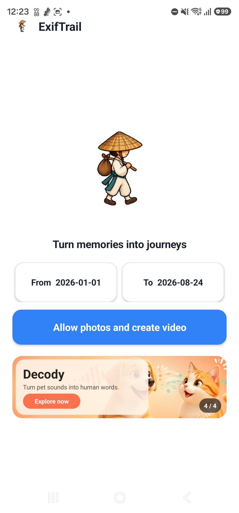
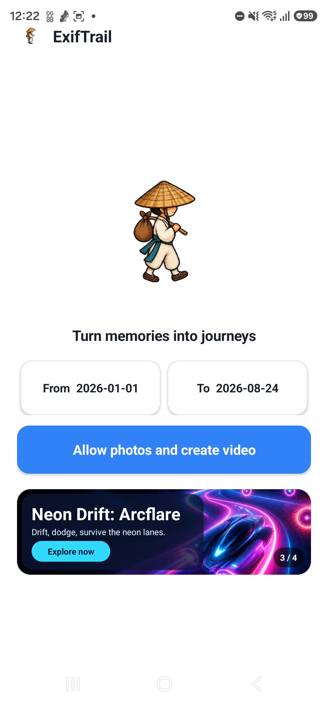
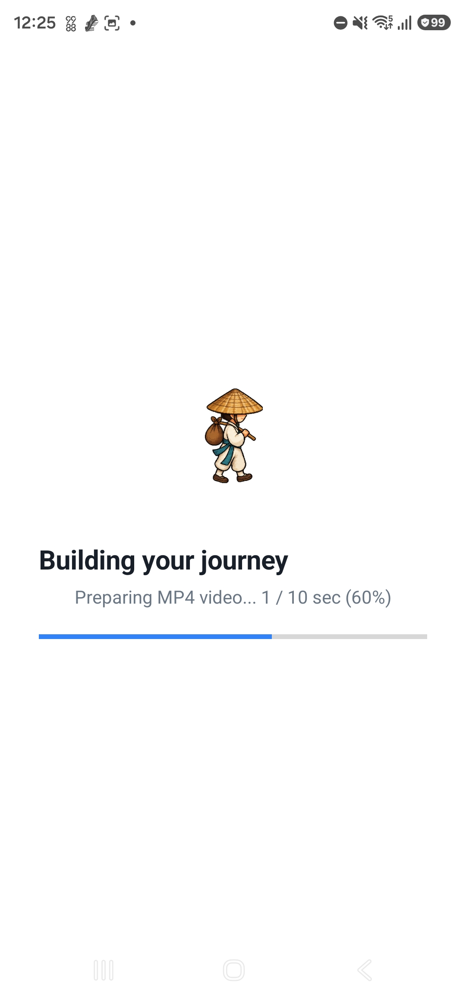

# ExifTrail

  <a href="README.en.md"><strong>🇬🇧 English</strong></a>
  &nbsp; · &nbsp;
  <a href="README.ko.md"><strong>🇰🇷 한국어</strong></a>

  <a href="https://amaranth92.github.io/exiftrail/">Live demo</a>
  &nbsp; · &nbsp;
  <a href="https://github.com/amaranth92/exiftrail">Source code</a>
  &nbsp; · &nbsp;
  <a href="LICENSE">MIT license</a>
  &nbsp; · &nbsp;
  <a href="https://github.com/amaranth92/exiftrail/raw/refs/heads/master/public/downloads/ExifTrail-Android.apk">Download Android APK</a>

  

ExifTrail is a privacy-first, open-source travel route video maker. It turns the
capture time and GPS metadata already stored in your travel photos into a
chronological map animation and vertical video.

Choose a language above to read the full documentation.

## Screenshots

<table>
  <tr>
    <td></td>
    <td></td>
  </tr>
  <tr>
    <td></td>
    <td></td>
  </tr>
</table>

## Sample video

<video controls width="320" poster="https://github.com/amaranth92/exiftrail/raw/refs/heads/master/public/docs/screenshots/exiftrail-4.jpg">
  <source src="https://github.com/amaranth92/exiftrail/raw/refs/heads/master/public/demo/exiftrail-sample-route.mp4" type="video/mp4">
</video>

[Open or download the sample MP4](https://github.com/amaranth92/exiftrail/raw/refs/heads/master/public/demo/exiftrail-sample-route.mp4)

## Install on Android

No Play Store account is required. Download the APK directly from GitHub and
follow the Android installation steps in the full guide:

[Read the Android installation guide](README.en.md#install-on-an-android-phone)
